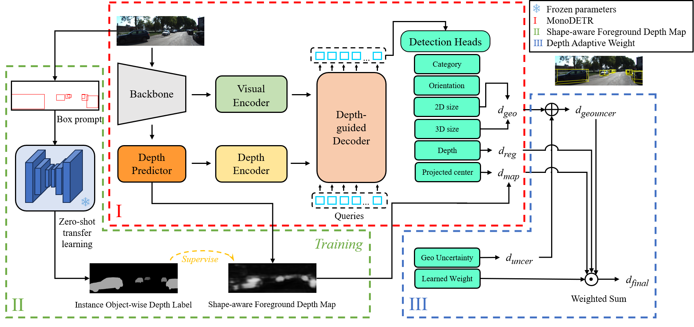

# SAW-MonoDETR: Shape-aware Adaptive Weighted Transformer for Monocular 3D Object Detection
Official implementation of "SAW-MonoDETR: Shape-aware Adaptive Weighted Transformer for Monocular 3D Object Detection".


## Introduction
Monocular 3D object detection offers a cost-effective alternative to LiDAR and stereo cameras by determining 3D positions from a single image. DETR-based methods leverage transformers to integrate visual and depth representations globally, achieving state-of-the-art performance and competitive speeds without manual configurations like non-maximum suppression or anchor generation. However, averaging multiple-depth predictions hinders precise accuracy. This work enhances depth prediction through two innovations: (1) improving depth quality using a Shape-aware Foreground Depth Map (SFDM) and (2) Depth Adaptive Weight (DAW) helps the final depth prediction to benefit flexibly from each component’s contribution. Experiments on the KITTI benchmark demonstrate the proposed model's state-of-the-art performance.
<div align="center">
  
</div>


## Installation
### InsMonoDETR
1. Clone this project and create a conda environment:
    ```
    git clone https://github.com/useracc687/saw-monodetr.git
    cd InsMonoDETR

    conda create -n insmonodetr python=3.8
    conda activate insmonodetr
    ```
    
2. Install pytorch and torchvision matching your CUDA version:
    ```bash
    python -m pip install torch==1.13.0+cu116 torchvision==0.14.0+cu116 torchaudio==0.13.0 --extra-index-url https://download.pytorch.org/whl/cu116
    # We adopt torch 1.13.0+cu116
    ```
    
3. Install requirements and compile the deformable attention:
    ```
    pip install -r requirements.txt

    cd lib/models/monodetr/ops/
    bash make.sh
    
    cd ../../../..
    ```
    
4. Make dictionary for saving training losses:
    ```
    mkdir logs
    ```
 
5. Download [KITTI](http://www.cvlibs.net/datasets/kitti/eval_object.php?obj_benchmark=3d) datasets and prepare the directory structure as:
    ```
    │MonoDETR/
    ├──...
    ├──data/KITTIDataset/
    │   ├──ImageSets/
    │   ├──training/
    │   ├──testing/
    ├──...
    ```
    Down load ImageSets files from here
    https://github.com/sshaoshuai/PointRCNN/tree/master/data/KITTI/ImageSets/data/KITTI/ImageSets 
    
    You can also change the data path at "dataset/root_dir" in `configs/monodetr.yaml` and "root_dir" (line 89) in `tools/mask_creator.py`.
### SAM

    pip install git+https://github.com/facebookresearch/segment-anything.git

## Get Started

### Create pseudo instance mask by SAM
    
    python tools/mask_creator.py
    
### Train
You can modify the settings of models and training in `configs/insmonodetr.yaml` and indicate the GPU in `train.sh`:

    bash train.sh configs/insmonodetr.yaml > logs/insmonodetr.log
   
### Test
The best checkpoint will be evaluated as default. You can change it at "tester/checkpoint" in `configs/insmonodetr.yaml`:

    bash test.sh configs/insmonodetr.yaml


## Acknowlegment
This repo benefits from the excellent [MonoDETR](https://github.com/ZrrSkywalker/MonoDETR.git).

<!-- ## Citation
```
to be updated
``` -->

<!-- ## Contact
If you have any questions about this project, please feel free to contact zhangrenrui@pjlab.org.cn. -->
